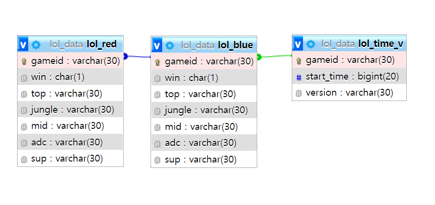
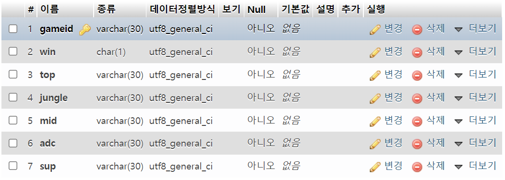
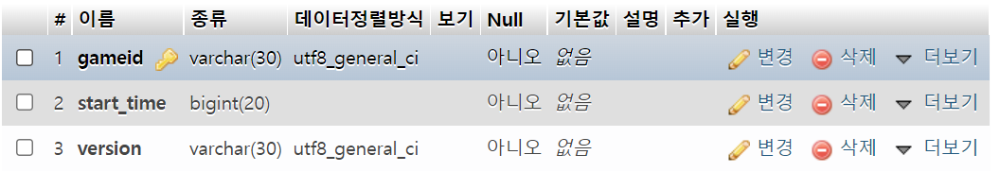

# riot project - 리그오브레전드 데이터 수집기

> 리그오브레전드 유저들의 경기를 가져오고, 분석하고, 저장합니다.


### 초기 세팅

1. api_key.txt 생성

   > proto_optimization_mariaDB.py가 위치한 디렉토리에 api_key.txt를 생성하고,
   >
   > ```
   > {자신의 api_key}+' '+'\n'
   > ```
   >
   > 을 입력합니다.
   >
   > 
   >
   > {자신의 api_key}는 등록된 정식application key를 사용해야합니다. 
   >
   > *24시간마다 만료되는 개발용 key를 사용시 정상 동작하지 않을 확률이 매우 높습니다.

2. Database 세팅

   > #### 1. 스키마 생성(lol_data)
   >
   > 
   >
   > 
   >
   > #### 2. 테이블 생성
   >
   > 1. lol_blue
   >    
   >
   > 2. lol_red
   >
   >    
   >
   > 3. lol_time_v
   >    
   >
   > #### 3. 코드 세팅
   >
   > 
   >
   > 1754행 start 함수 호출부 코드를 자신이 원하는 버전과 티어에 맞게 세팅합니다.
   >
   > ```
   > start({수집을 원하는 버전 패치일}, {수집을 원하는 티어}, {수집을 원하는 버전})
   > ```
   >
   > 

### 																												세팅 끝	

